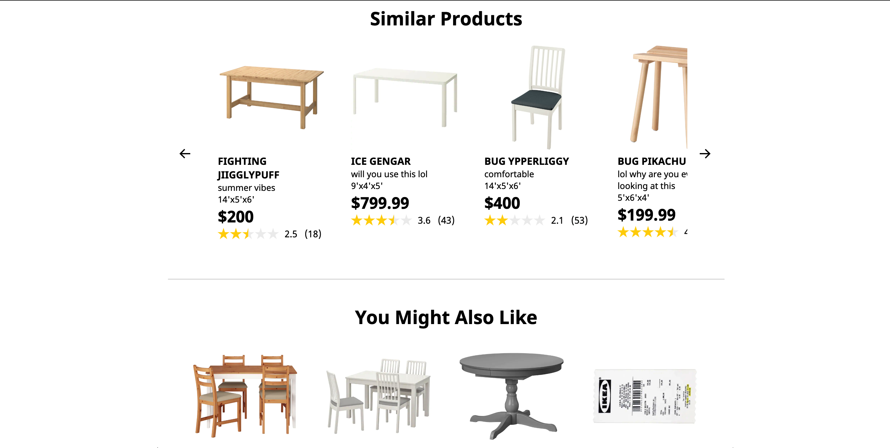

# Distributed Systems Backend Optimization Capstone Project

Backend optimization of legacy IKEA recommended products & similar products microservice
<br/><br/>
&nbsp;
&nbsp;
&nbsp;
Recommended & Similar Products Display:
&nbsp;

&nbsp;
&nbsp;
<br/><br/>
&nbsp;
&nbsp;
## Table of Contents

1. [Usage](#Usage)
2. [Requirements](#requirements)
3. [Development](#development)


## Usage

### Setting up database/seeding data

```sh
npm run setupdb
```

### start script

```sh
npm start
```

## Requirements

An `nvmrc` file is included if using [nvm](https://github.com/creationix/nvm).

- Node 6.13.0

Also, change connection params in /db-pg/query/dbGet.js to your database connection params

## Development


### Installing Dependencies

From within the root directory:

```sh
npm install -g webpack
npm install
```

### CRUD API

Read/GET:
```
server.get('/products')
server.get('/products/:id')
```